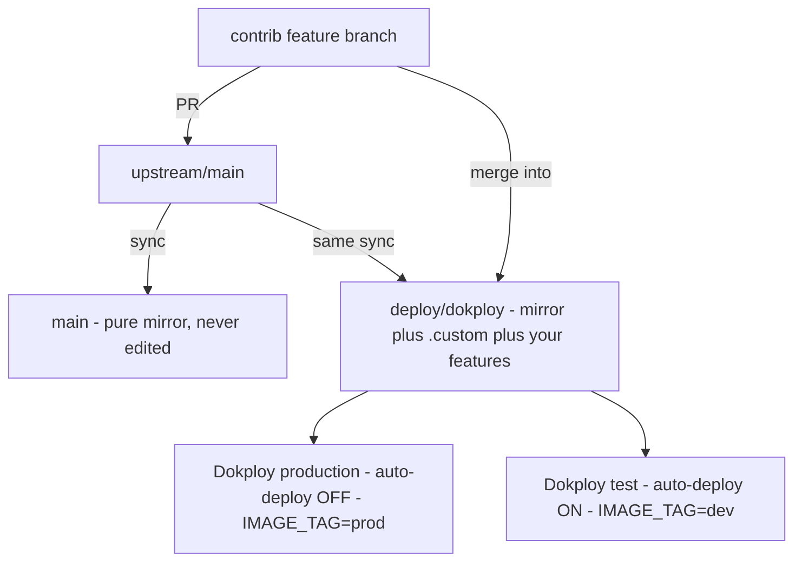

# .custom — your deployment layer

Everything in this folder is **yours**. Upstream (`truefoundry/trueforge`) has no
`.custom/` directory, so nothing here can ever conflict when upstream changes.
Keep it that way: fork-only config goes in here, not in upstream's files.



## The three things that matter

1. **Dokploy builds the branch `deploy/dokploy`** with the compose path
   `./.custom/docker-compose.yml`. Both services point at the same branch and the
   same file; they differ only in their Dokploy environment variables.
2. **Secrets and per-environment values live in Dokploy, not in this repo.**
   Service → _Environment_ tab. Required: `POSTGRES_PASSWORD`, `PUBLIC_BASE_URL`,
   `TRUEFORGE_API_KEY`. Plus `IMAGE_TAG` (`prod` for one service, `dev` for the
   other) so they don't share one image tag.
3. **`./.custom/.env` is for local `docker compose` runs only.** It is gitignored,
   and Dokploy never reads it — Dokploy writes its own copy inside its clone from
   the Environment tab. Keys your compose doesn't forward (`POSTGRES_SCHEMA`,
   `ACCESS_LOGS`, `GRACEFUL_TIMEOUT_SECONDS`, `SERVER_EXECUTION_TIMEOUT_SECONDS`)
   do nothing inside the containers; add them to the compose's `environment:`
   block if you want them to apply.

## Everyday commands

Run these from the repo root, on `deploy/dokploy`:

| What you want                    | Command                                                |
| -------------------------------- | ------------------------------------------------------ |
| Pull in upstream's latest        | `scripts/fork-sync.sh sync`                            |
| Turn a deployed commit into a PR | `scripts/fork-sync.sh pr contrib/my-feature <sha>`     |
| Deploy to production             | Dokploy → service → **Deploy** (it never auto-deploys) |

`sync` updates `main` (the mirror), merges upstream into `deploy/dokploy`, and
pushes both. If it stops, it listed the conflicting files. Resolve them, then:

```sh
git add <files> && git commit --no-edit && git push origin deploy/dokploy
```

Today this is manual. A scheduled GitHub Action can run the same command (it just
needs the fork's default branch to be `deploy/dokploy`).

## House rules — these prevent most of the pain

- **Don't edit files upstream owns.** `Dockerfile`, `docker-compose.yml`,
  `package.json`, source files — every edit there is a future merge conflict.
  Fork-only config goes in `.custom/`, fork-only scripts in `scripts/`.
  Your two features are the deliberate exception, and only until upstream takes
  them.
- **Don't add a top-level `name:` to the compose.** Dokploy runs it with
  `-p <appName>`, so project, volume and network names are already unique per
  service. A `name:` would compete with that.
- **The controller command must stay `node dist/controller-main.js`.** The
  from-source image builds into `/app/packages/trueforge`. The
  `node_modules/@truefoundry/trueforge/...` path only exists in `Dockerfile.npm`,
  the npm-install recipe — pointing at it crash-loops the controller.
- **Don't run SDK regeneration on this branch.** Generated SDK files are carried
  from feature branches; regenerating here drops methods the UI calls.
- **Leave the root `docker-compose.yml` and `docker-compose.dev.yml` alone.**
  They're upstream's local stacks and unused by Dokploy.

## Troubleshooting

| Symptom                                                                                             | Cause                                                                                                       | Fix                                                                                               |
| --------------------------------------------------------------------------------------------------- | ----------------------------------------------------------------------------------------------------------- | ------------------------------------------------------------------------------------------------- |
| Deploy dies in ~3s, `Compose file not found`                                                        | Compose path points at a file that isn't on the branch                                                      | Set compose path to `./.custom/docker-compose.yml`                                                |
| Deploy dies ~1 min in, `error TS...` in a package build                                             | The branch doesn't compile                                                                                  | Read the error, fix it on `deploy/dokploy`. Usual cause: a generated SDK/type isn't on the branch |
| Deploy says "done" but nothing changed                                                              | Production has auto-deploy off                                                                              | Click **Deploy**                                                                                  |
| Controller restarts every ~60s, `MODULE_NOT_FOUND .../node_modules/@truefoundry/trueforge/dist/...` | `command:` got reverted to the npm-image path                                                               | Set it back to `node dist/controller-main.js`                                                     |
| `healthz` is ok but a feature looks missing                                                         | `healthz` reports the server only, and the version string comes from release changesets — not your features | Check the deployment log for the commit it built                                                  |
| `sync` stops with conflicts                                                                         | Upstream changed the same lines as an unmerged feature                                                      | Resolve, commit, push. For generated files, take upstream's side                                  |

## What "done" looks like

- Deployment log ends with `Docker Compose Deployed: ✅`
- `postgres` and `redis` stay `Running` across deploys — your data is in the
  `trueforge_postgres` volume. Only use fresh volumes if you _want_ to wipe it.
- `server` and `controller` are recreated and healthy, and the controller logs
  `Controller started` with loop `schedule-dispatch`.
